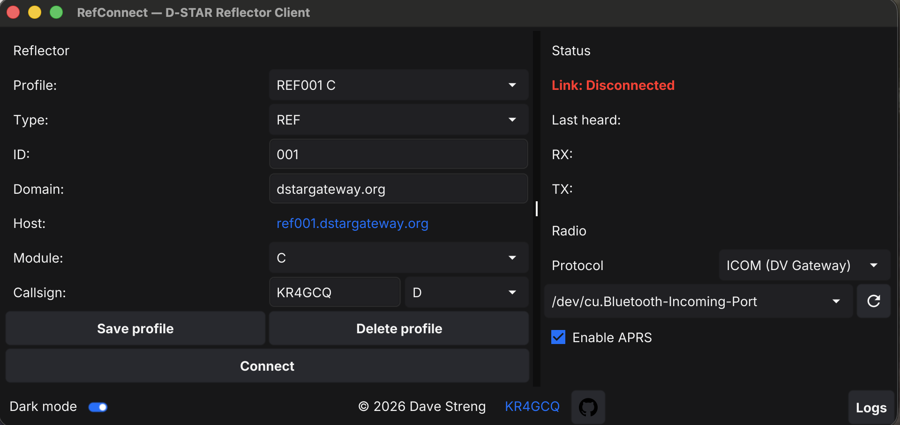

[](https://github.com/S7R4nG3/refconnect/actions/workflows/dependabot/dependabot-updates)

[](https://github.com/S7R4nG3/refconnect/actions/workflows/ci.yml)

# RefConnect

A D-STAR reflector client for macOS, Windows, and Linux that connects your D-STAR radio to internet-based reflectors via serial port. Supports DExtra (XRF), DPlus (REF), and XLX reflector protocols.



--- 

## Features

- Multi-OS Support! (Linux/MacOS/Windows)
- Connect to REF/XRF/XLX reflectors via DPlus/DExtra/XLX protocols
- Supports ICOM (DV Gateway Terminal) and Kenwood (MMDVM) radio protocols
- Serial port integration with D-STAR radios via USB
- Saved reflector profiles with last-used memory
- Dark, light, or system theme support
- Timestamped activity log

## Simple Setup

MacOs & Linux:

```shell
curl -fsSL https://raw.githubusercontent.com/S7R4nG3/refconnect/main/configs/setup.sh | sh
```

Windows:

```powershell
iwr -useb https://raw.githubusercontent.com/S7R4nG3/refconnect/main/configs/setup.ps1 | iex
```

Check out the [Wiki](https://github.com/S7R4nG3/refconnect/wiki) for more information!


## Configuration

On first launch, a default configuration is created at:

```
~/.config/refconnect/config.yaml
```

Key settings:

```yaml
version: 1
callsign: N0CALL
callsign_suffix: G
radio:
    port: /dev/cu.usbmodem1203
    protocol: DV-GW              # "DV-GW" (ICOM) or "MMDVM" (Kenwood)
reflectors:
    - name: REF001 C
      host: ref001.dstargateway.org
      port: 20001
      module: C
      protocol: DPlus
last_used_reflector: "REF001 C"
ui:
    theme: system                # "dark", "light", or "system"
    log_max_lines: 500
    window_width: 960
    window_height: 720
```

| Field | Description |
|---|---|
| `callsign` | Your amateur radio callsign |
| `callsign_suffix` | Gateway module suffix (e.g. `G` for gateway). This is the 8th character of your callsign as shown in Via/Peer on reflector dashboards |
| `radio.port` | Serial port path for your radio |
| `radio.protocol` | `DV-GW` for ICOM radios, `MMDVM` for Kenwood radios. Baud rate is set automatically (38400 / 115200) |
| `reflectors` | Saved reflector profiles, selectable from the Connect panel |
| `ui.theme` | `dark`, `light`, or `system` |

## Usage

1. **Select your radio** — Choose the protocol (ICOM or Kenwood) and serial port in the Radio panel, then click **Open**.
2. **Select a reflector** — Choose a saved reflector profile or enter a new one in the Connect panel.
3. **Enter your callsign** — Set your callsign and gateway module suffix.
4. **Click Connect** — The status panel will update once the link is established.
5. **Transmit** — Key up on your radio! Welcome to D-STAR!

The log panel shows timestamped activity including connections, heard callsigns, and errors.

## License

See [LICENSE](LICENSE).

©️ 2026 Dave Streng (KR4GCQ)

This project is supported by me alone... Feel free to [Donate](https://www.paypal.com/donate/?hosted_button_id=J3YVE7V6F8NN2) if you're feeling generous! :)